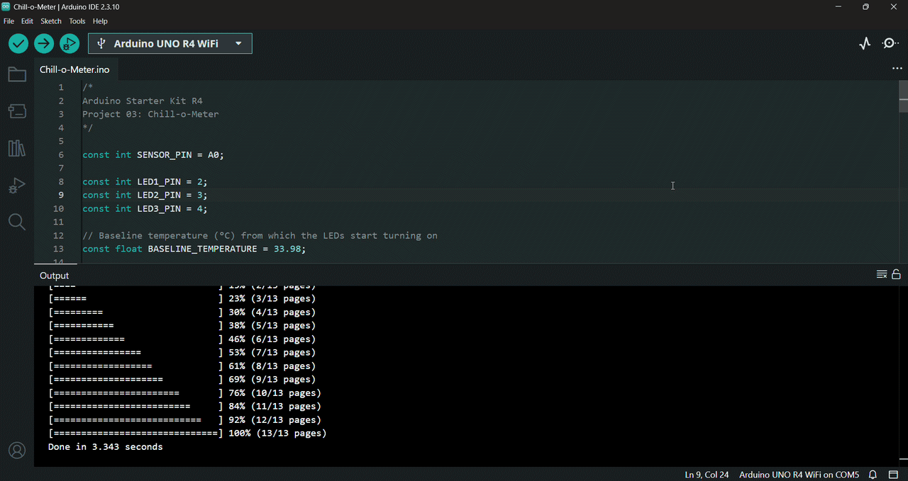

# 🌡️ Chill-o-Meter

In this project, I built a simple Arduino-based temperature monitoring system that uses a TMP36 sensor to measure temperature and three LEDs to visually indicate changes relative to a predefined baseline.

This project is based on Project 03 from the Arduino Starter Kit R4. 

---

## 🔎 Circuit Demo

---

## 🎯 Objective

The purpose of this project is to learn how to read and process analog sensor data using the Arduino board's built-in Analog-to-Digital Converter (ADC), display the measurements in the Serial Monitor, and control LEDs based on temperature.

---

## 🔋 Components

List of hardware components used:
- Arduino UNO R4 WiFi Board
- USB-C Cable
- Breadboard
- 3x 220 Ohm Resistor
- 3x Red LED
- 1x TMP36 Temperature Seensor 
- Solid Core Jumber Wires
- Stranded Jumper Wires

---

## 🛠️ Circuit Implementation

This project demonstrates a temperature monitoring system using an *Arduino UNO R4 WiFi Board* to measure temperature changes via a *TMP36 Temperature Sensor* and display temperature levels using three *LED* indicators.

### 🔌 Power Source
* **5V** on Arduino $\rightarrow$ Positive ($+$) rail of the *breadboard* (Red wire)
* **GND** on Arduino $\rightarrow$ Negative ($-$) rail of the *breadboard* (Black wire)

### 💡 Output Section: LED Indicators
Three *red LEDs* are placed on the *breadboard* to serve as visual threshold indicators.

* **Ground Connections:** For every individual *LED*, a *220Ω resistor* connects its cathode (short leg) directly to the common ground ($-$) rail of the *breadboard*.
* **Signal Lines (Digital Pins):**
  * The anodes (long legs) of the three *LEDs* connect to Arduino digital pins 2, 3, and 4, respectively.

### 🌡️ Input Section: TMP36 Temperature Sensor 
A *TMP36 Temperature Sensor* acts as the primary analog input component.

* **Orientation:** Inserted into the *breadboard* with its flat side facing forward / toward the user (rounded side facing away from the board).
* **Power Connection:** The left pin (with the flat side facing the user) connects directly to the positive ($+$) power rail.
* **Ground Connection:** The right pin connects directly to the common ground ($-$) rail.
* **Signal Connection:** The middle pin connects directly to Arduino analog input pin *A0* (Analog Pin 0) via a signal jumper wire.

### ⚠️ Safety Tip
To ensure hardware safety, the *Arduino board* is strictly kept disconnected from any power source (via the *USB-C cable*) throughout the circuit assembly process. The board is only connected to the computer via the *USB-C cable* once all physical connections and circuit designs are fully completed and verified.

---

## 📤 Setup & Upload

1. Connect your *Arduino Board* to your computer using the *USB-C Cable*.
2. Open the `.ino` file in the Arduino IDE.
3. Select the correct `Board` and `Port` from the `Tools` menu.
4. Click `Upload` to compile and upload the sketch to the board.
5. Once the upload is complete, click the `Serial Monitor` icon and the program will start running automatically.

You can update the `BASELINE_TEMPERATURE` constant in your sketch with the ambient temperature value you observe.

---

## ⚙️ How it Works

The circuit operates as a dynamic temperature-sensing indicator based on the analog voltage reading from the TMP36 sensor:

* **Idle / Baseline State (Sensor Un-touched):** 
  * The sensor measures the baseline ambient room temperature.
  * When the temperature is low (at or near ambient temperature), all three *LEDs* (pins 2, 3 & 4) remain turned `OFF`.

* **Low Temperature Rise (1 LED ON):**
  * When you touch the sensor and the detected temperature slightly increases past the first threshold:
  * The first *LED* (pin 2) turns `ON`, indicating a mild temperature rise.
  * The remaining two *LEDs* stay `OFF`.

* **Moderate Temperature Rise (2 LEDs ON):**
  * As heat transfers from your fingers and the temperature reaches a second higher threshold:
  * Two *LEDs* (pins 2 & 3) turn `ON` simultaneously, indicating a moderate temperature rise.
  * The remaining *LED* stays `OFF`.

* **High Temperature Rise (3 LEDs ON):**
  * When the detected temperature exceeds the maximum defined threshold:
  * All three *LEDs* (pins 2, 3 & 4) turn `ON` simultaneously, indicating peak temperature.

---

## 💻 Code

The program is organized into two main functions:

- `setup()` – Initializes the *Serial Monitor*, configures the *LED* pins as outputs, and ensures that all LEDs are initially turned off.
- `loop()` – Continuously reads the *temperature sensor*, converts the analog reading into *voltage* and *temperature*, displays the measured values in the *Serial Monitor*, and turns on the appropriate number of *LEDs* based on the measured temperature.

### Key Functions Used

- `Serial.begin()` – Initializes serial communication with the *Serial Monitor* at 9600 communication speed (baud rate).
- `pinMode()` – Configures the *LED* pins as outputs.
- `digitalWrite()` – Turns the *LEDs* on or off.
- `analogRead()` – Reads the analog value from the *TMP36 Temperature Sensor*.
- `Serial.print()` / `Serial.println()` – Displays the sensor reading, calculated voltage, and temperature in the *Serial Monitor*.
- `delay()` – Adds a short pause before the next measurement in order to avoid broken results.

---

## 🎓 What I Learned

Through building this project, I gained hands-on experience and practical knowledge about Arduino programming and analog electronics:

* **Analog Inputs and ADC**
  * Learned how to read analog signals using the Arduino's built-in *Analog-to-Digital Converter (ADC)*.
  * Understood how analog sensor readings are converted into digital values.

* **Working with a Temperature Sensor**
  * Learned how to correctly connect and use a *TMP36 Temperature Sensor* in an Arduino circuit.
  * Understood how to convert the sensor's analog output into voltage and then into temperature (°C).

* **Serial Communication**
  * Learned how to initialize and use the *Serial Monitor* for debugging and displaying sensor measurements.
  * Gained experience using `Serial.begin()`, `Serial.print()`, and `Serial.println()`.

* **Decision Making**
  * Practiced using `if`, `else if`, and `else` statements to control multiple *LEDs* according to different temperature ranges.

* **Arduino Programming Basics**
  * Gained experience using essential Arduino functions such as `setup()`, `loop()`, `analogRead()`, `pinMode()`, `digitalWrite()`, and `delay()`.

---

## 🚀 Future Improvements

Possible extensions for this project include:

* Display the measured temperature on an LCD or OLED screen instead of using only the *Serial Monitor*.
* Allow the user to adjust the baseline temperature dynamically using a potentiometer or pushbuttons.
* Expand the project by controlling external devices (such as a fan or relay) automatically when the temperature reaches specific levels.
