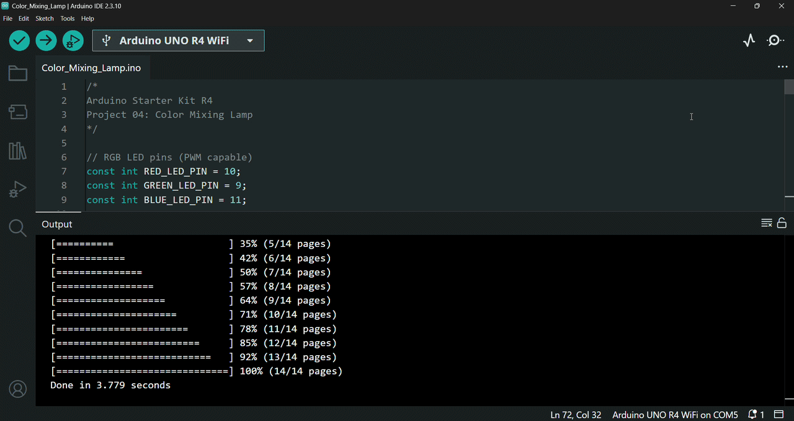

# 🎨 Color Mixing Lamp

In this project, I built an Arduino-based RGB lamp that uses three phototransistors with colored gel filters to detect light intensity and adjust the brightness of the red, green, and blue LED channels accordingly.

This project is based on Project 04 from the Arduino Starter Kit R4. 

---

## 🔎 Circuit Demo

---

## 🎯 Objective

The purpose of this project is to understand how sensor readings from phototransistors are mapped to Pulse Width Modulation (PWM) values and how PWM is used to control RGB LED brightness as an analog-like output.

---

## 🔋 Components

List of hardware components used:
- Arduino UNO R4 WiFi Board
- USB-C Cable
- Breadboard
- 3x 220 Ohm Resistor
- 3x 10K Ohm Resistor
- 1x RGB LED
- 3x Phototransistor
- 3x Gel Filter (red, green, blue)
- Solid Core Jumber Wires
- Stranded Jumper Wires

---

## 🛠️ Circuit Implementation

This project demonstrates a Color Mixing Lamp system using an *Arduino UNO R4 WiFi Board*, three *Phototransistors* paired with colored *Gel Filters (red, green, blue)* as analog light sensors, and a 4-pin common-cathode *RGB LED* as the visual output.

### 🔌 Power Source
* **5V** on Arduino $\rightarrow$ Positive ($+$) power rail of the *breadboard* (Red wire)
* **GND** on Arduino $\rightarrow$ Negative ($-$) ground rail of the *breadboard* (Black wire)
* **Rail Jumper:** Red jumper wire connects the power ($+$) rail across the breadboard so both sides have active power.

### ☀️ Input Section: Light Sensors (Phototransistors & Color Gels)
Three *phototransistors* measure incoming ambient light levels. *Red, green, and blue gel filters* are placed over each sensor to selectively measure individual color channels.

* **Polarity & Power Connection:** The long end (anode) of each *phototransistor* connects to the positive ($+$) power rail.
* **Pull-Down Resistors:** A *10kΩ resistor* connects the short end of each *phototransistor* to the common ground ($-$) rail to create a voltage divider.
* **Signal Connections (Analog Input Pins):**
  * **Red Sensor (A0):** Connected between the *resistor* junction of the red-filtered *phototransistor* and Arduino pin A0.
  * **Green Sensor (A1):** Connected between the *resistor* junction of the green-filtered *phototransistor* and Arduino pin A1.
  * **Blue Sensor (A2):** Connected between the *resistor* junction of the blue-filtered *phototransistor* and Arduino pin A2.
* **Color Filters:** Colored *gels* are placed over the sensors (red over A0, green over A1, blue over A2) to isolate specific light wavelengths.

### 🎨 Output Section: RGB LED Indicator
A 4-pin common-cathode *RGB LED* acts as the primary light output, dynamically blending colors based on sensor input.

* **Ground Connection (Common Cathode):** The longest pin (cathode) connects directly to the common ground ($-$) rail of the breadboard.
* **Signal Lines (PWM Pins via 220Ω Resistors):**
  Each color anode connects in series through a *220Ω current-limiting resistor* to its respective Arduino PWM digital pin:
  * **Red Anode Pin** $\rightarrow$ *220Ω resistor* $\rightarrow$ Arduino Digital Pin 10 (PWM)
  * **Green Anode Pin** $\rightarrow$ *220Ω resistor* $\rightarrow$ Arduino Digital Pin 9 (PWM)
  * **Blue Anode Pin** $\rightarrow$ *220Ω resistor* $\rightarrow$ Arduino Digital Pin 11 (PWM)

### ⚠️ Safety Tip
To ensure hardware safety, the *Arduino board* is strictly kept disconnected from any power source (via the *USB-C cable*) throughout the circuit assembly process. The board is only connected to the computer via the *USB-C cable* once all physical connections and circuit designs are fully completed and verified.

---

## 📤 Setup & Upload

1. Connect your *Arduino Board* to your computer using the *USB-C Cable*.
2. Open the `.ino` file in the Arduino IDE.
3. Select the correct `Board` and `Port` from the `Tools` menu.
4. Click `Upload` to compile and upload the sketch to the board.
5. Once the upload is complete, click the `Serial Monitor` icon and the program will start running automatically.

---

## ⚙️ How it Works

The circuit operates as an interactive color-mixing system that continuously reads surrounding light levels through three *phototransistors* and dynamically controls the output color and intensity of an *RGB LED*:

* **Light Sensing (Inputs):** 
  * The three phototransistors read analog voltage levels corresponding to light intensity through their respective color filters (Red on A0, Green on A1, Blue on A2).
  * Each sensor returns a raw 10-bit analog reading ranging from `0` to `1023` (where higher values indicate higher light exposure).

* **Signal Processing & Mapping (Program Logic):**
  * The Arduino processes each sensor reading sequentially with a brief 5ms delay between readings to ensure accurate analog-to-digital conversions.
  * Raw sensor values (`0-1023`) are converted into 8-bit PWM duty cycles (`0-255`) by dividing each value by 4 (`sensorValue / 4`).
  * The raw and mapped PWM values are logged to the Serial Monitor at `9600 baud` for real-time monitoring and debugging.

* **Dynamic Light Output (PWM Outputs):**
  * The calculated brightness values are sent to the RGB LED pins:
    * Red channel on Pin 10
    * Green channel on Pin 9
    * Blue channel on Pin 11
  * The RGB LED combines these three independent PWM channels to generate a blended custom color and overall brightness.

* **Interactive User Behavior:**
  * **Ambient Light Baseline:** Under steady room lighting, the RGB LED emits a baseline mixed color corresponding to the current light intensity hitting each sensor.
  * **Light Manipulation (Flashlight / Uncovering):** Directing a light source (e.g., a phone flashlight) or exposing a specific phototransistor increases its corresponding PWM output, causing that color component to dominate the RGB LED's output.
  * **Partial / Full Covering:** Covering a sensor with a finger or blocking ambient light lowers its corresponding PWM value, dimming that specific color channel and shifting the blended hue toward the remaining active colors.

---

## 💻 Code

The program is organized into two main functions:

- `setup()` – Initializes the *Serial Monitor* and configures the *RGB LED* pins as PWM outputs.
- `loop()` – Continuously reads the three *phototransistor* values, displays the raw sensor readings, maps the ADC values (0–1023) to PWM values (0–255), prints the mapped values to the *Serial Monitor*, and adjusts the brightness of each *RGB LED* channel using PWM.

### Key Functions Used

- `Serial.begin()` – Initializes serial communication with the *Serial Monitor* at 9600 communication speed (baud rate).
- `pinMode()` – Configures the *RGB LED* pins as outputs.
- `analogRead()` – Reads the analog values from the three *phototransistors*.
- `delay()` – Adds a short pause between sensor readings to improve measurement stability.
- `Serial.print()` / `Serial.println()` – Displays both the raw sensor readings and the mapped PWM values in the *Serial Monitor*.
- `analogWrite()` – Controls the brightness of each *RGB LED* channel using PWM.

---

## 🎓 What I Learned

Through building this project, I gained hands-on experience and practical knowledge about Arduino programming, analog inputs, and Pulse Width Modulation (PWM):

* **Analog Inputs and PWM**
  * Learned how sensor readings from *phototransistors* are mapped from ADC values (0–1023) to PWM values (0–255).
  * Understood how Pulse Width Modulation (PWM) can be used to create an analog-like output by controlling the brightness of an *RGB LED*.

* **Working with Phototransistors and an RGB LED**
  * Learned how to identify and correctly connect *phototransistors* and a *common cathode RGB LED* in an Arduino circuit.
  * Practiced distinguishing between anodes and cathodes to ensure proper circuit wiring.

* **Using Analog and PWM Pins**
  * Gained additional hands-on experience using the Arduino's analog input pins to read sensor values.
  * Used the Arduino's PWM-capable pins for the first time to control *LED* brightness.

* **PWM Output with `analogWrite()`**
  * Learned how to use the `analogWrite()` function to generate PWM signals.
  * Understood how different PWM values directly affect the intensity of each *RGB LED* channel.

* **Monitoring and Data Conversion**
  * Practiced displaying both raw sensor readings and mapped PWM values in the *Serial Monitor*.
  * Reinforced the relationship between analog sensor input, digital processing, value mapping, and analog-like output.

---

## 🚀 Future Improvements

Possible extensions for this project include:

* Automatic color calibration by measuring the minimum and maximum sensor values during startup and dynamically adjusting the mapping range for more accurate color reproduction.
* Smoother brightness transitions by applying averaging or filtering techniques to the sensor readings, reducing flickering caused by rapid changes in light intensity.
* Custom color effects and operating modes, such as color presets, automatic fading animations, or different response curves between the *phototransistors* and the *RGB LED*.
