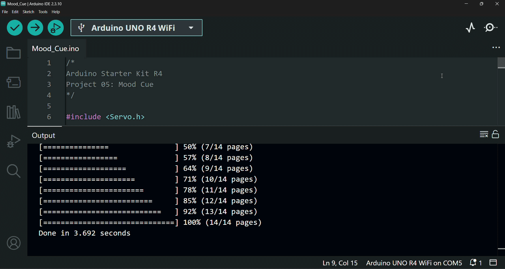

# ✨ Mood Cue

In this project, I built an Arduino mood cue that uses a *potentiometer* to control a *servo motor*, demonstrating how analog input can be translated into precise mechanical movement.

This project is based on Project 05 from the Arduino Starter Kit R4.

---

## 🔎 Circuit Demo

$\rightarrow$ To transform the circuit into a functional mood cue, you can create a cardboard arrow and a paper half-circle containing different mood options. Place the arrow on the *motor arm* and position the semicircle below the *servo motor*, allowing the *servo* movement to indicate the selected mood.

---

## 🎯 Objective

The purpose of this project is to gain further experience with mapping sensor values, understand *servo motor* control, and learn how to utilize built-in Arduino libraries to simplify hardware programming.

---

## 🔋 Components

List of hardware components used:
- Arduino UNO R4 WiFi Board
- USB-C Cable
- Breadboard
- 2 x 100 µF Capacitors
- 1 x 10k ohm Potentiometer
- 1 x Servo Motor
- 3 x Male Header Pins
- 1 x Motor Arm
- Solid Core Jumber Wires
- Stranded Jumper Wires

---

## 🛠️ Circuit Implementation

This project demonstrates a servo motor control system using an *Arduino UNO R4 WiFi Board* to control the position of a *Servo Motor* using a *Potentiometer* as an analog input controller. Decoupling capacitors are included to stabilize the voltage across components.

### 🔌 Power Source
* **5V** on Arduino $\rightarrow$ Positive ($+$) power rail of the *breadboard* (Red wire)
* **GND** on Arduino $\rightarrow$ Negative ($-$) ground rail of the *breadboard* (Black wire)

### 🎛️ Input Section: Potentiometer
A *potentiometer* acts as an analog voltage divider to sense user knob adjustments.

* **Outer Pins:** One outer pin connects to the positive ($+$) 5V rail and the other outer pin connects to the common ground ($-$) rail.
* **Signal Connection (Middle Pin):** The middle wiper pin connects directly to Arduino analog input pin `A0` via a signal jumper wire to send voltage readings to the board.

### ⚙️ Output Section: Servo Motor
A *servo motor* acts as the primary mechanical output component.

* **Header Connections:** Three *male header pins* are inserted into the servo's female connector to facilitate connection to the *breadboard*.
* **Power Wire (Red):** Connects to the positive ($+$) 5V power rail.
* **Ground Wire (Black):** Connects to the common ground ($-$) rail.
* **Control Line (White):** Connects to Arduino digital PWM pin `9` via a signal wire to receive positioning control signals.

### 🔋 Decoupling Capacitors
Two *100µF capacitors* are placed across the circuit to decouple voltage drops and smooth out potential fluctuations:

* **Potentiometer Capacitor:** Placed across power ($+$) and ground ($-$) near the *potentiometer* to stabilize its input signal readings.
* **Servo Capacitor:** Placed across the power ($+$) and ground ($-$) lines directly adjacent to the *servo motor* headers to smooth out voltage dips caused by initial motor movement spikes.
* **Polarity Warning:** Both capacitors are directional; their negative leads (marked with a white stripe/minus sign) connect strictly to the ground ($-$) rail, while positive leads connect to the 5V ($+$) rail.

### ⚠️ Safety Tip
To ensure hardware safety, the *Arduino board* is strictly kept disconnected from any power source (via the *USB-C cable*) throughout the circuit assembly process. The board is only connected to the computer via the *USB-C cable* once all physical connections and circuit designs are fully completed and verified.

---

## 📤 Setup & Upload

1. Connect your *Arduino Board* to your computer using the *USB-C Cable*.
2. Open the `.ino` file in the Arduino IDE.
3. Select the correct `Board` and `Port` from the `Tools` menu.
4. Click `Upload` to compile and upload the sketch to the board.
5. Once the upload is complete, click the `Serial Monitor` icon and the program will start running automatically.

---

## ⚙️ How it Works

The circuit operates as an interactive *servo* positioning system that continuously reads the manual rotation of a *potentiometer* and dynamically controls the angle of a *servo motor*:

* **Analog Input Sensing (Inputs):** 
  * The *potentiometer* acts as an analog input connected to pin `A0`.
  * The *Arduino UNO R4 WiFi* is configured for 12-bit Analog-to-Digital Conversion (ADC), which allows the board to read high-resolution voltage values ranging from `0` to `4095` as the knob is rotated.

* **Signal Processing & Mapping (Program Logic):**
  * The code reads the current raw ADC value from the *potentiometer* (`0-4095`).
  * The program maps the 12-bit input reading directly to the full rotational angle range of the *servo motor* (`0°-179°`).
  * The raw *potentiometer* reading and calculated *servo* angle are logged to the Serial Monitor at `9600` baud rate for real-time monitoring and feedback.

* **PWM Servo Control (Output):**
  * The calculated angle (`0°-179°`) is sent to the *servo motor* via digital PWM pin `9`.
  * A small delay of `15ms` is executed at the end of each loop iteration to give the physical motor shaft sufficient time to move smoothly to its new target position.

* **Interactive User Behavior:**
  * Adjusting the *potentiometer* directly controls the *servo motor* in real time—as the *potentiometer* turns, the *motor* responds by rotating to the matching position.

---

## 💻 Code

The program is organized into two main functions:

- `setup()` – Initializes the *Serial Monitor*, configures the *servo motor* pin, and prepares the *Arduino board* for operation.
- `loop()` – Continuously reads the *potentiometer* value, maps the ADC reading (`0-4095`) to a *servo* angle range (`0°-179°`), displays both values in the *Serial Monitor*, and moves the *servo motor* to the corresponding position.

### Key Functions Used

- `analogReadResolution()` – Configures the ADC resolution to 12 bits, allowing analog readings from `0` to `4095`.
- `Servo.attach()` – Connects the *servo motor* object to the selected Arduino pin.
- `Serial.begin()` – Initializes serial communication with the *Serial Monitor* at `9600` baud rate.
- `analogRead()` – Reads the analog value from the *potentiometer*.
- `map()` – Converts the *potentiometer* ADC value into a corresponding *servo* angle.
- `Serial.print()` / `Serial.println()` – Displays the *potentiometer* readings and calculated *servo* angle in the *Serial Monitor*.
- `Servo.write()` – Moves the *servo motor* to the specified angle.
- `delay()` – Adds a short pause to allow the *servo motor* to reach the desired position.

---

## 🎓 What I Learned

Through building this project, I gained hands-on experience and practical knowledge about Arduino programming, analog inputs, servo motor control, and electronic components:

* **Analog Inputs and Value Mapping**
  * Learned that a *potentiometer* works as a variable voltage divider, where the voltage at its middle pin changes from 0V to 5V (provided by the *Arduino board*) as the knob is turned.
  * Understood how the Arduino reads this variable voltage through an analog input and translates it into precise mechanical movement by controlling a *servo motor*.
  * Gained further experience with value mapping using the `map()` function to convert ADC readings into a suitable output range.

* **Servo Motor Control**
  * Learned that *servo motors* are special types of motors that can rotate within a limited range (typically `0°-180°`) and remain at a specific position until a new command is received.
  * Learned how to use Arduino libraries, creating objects from them and controlling hardware through built-in functions.
  * Practiced using the `Servo.attach()` function to connect a *servo motor* to an Arduino pin and the `Servo.write()` function to move it to a desired angle.
  * Learned how to configure the Arduino ADC resolution using `analogReadResolution()`.

* **Working with Electronic Components**
  * Learned how to identify and correctly use common components such as *potentiometers*, *servo motors*, and *capacitors* in real-world circuits.
  * Practiced connecting a *potentiometer*, which has three pins: power, ground, and an output pin used as an analog input.
  * Learned how to connect a *servo motor*, which uses three wires: power (red), ground (black), and a control signal wire (white).

* **Capacitors and Circuit Stability**
  * Learned that *capacitors* can be used to smooth out voltage fluctuations and sudden changes in a circuit.
  * Understood the role of *decoupling capacitors*, which reduce or isolate voltage changes caused by components to prevent them from affecting the rest of the circuit.
  * Learned how to identify *capacitor* polarity by locating the marked negative terminal (white stripe/minus sign).
  * Understood that incorrect connections of polarized *capacitors* can even make these components explode.

* **Breadboard Connections and Measurement Tools**
  * Learned to distinguish between *male header pins* and female header pins and understand their different applications when connecting components, such as a *servo motor*, to a *breadboard*.
  * Learned how to measure *capacitor* capacitance using a multimeter.

---

## 🚀 Future Improvements

Possible extensions for this project include:

* Adding an LCD/OLED display to show the selected mood option and provide a more interactive user experience.
* Using multiple inputs or sensors (such as buttons, temperature sensors, or light sensors) to create a more advanced mood detection and control system.
* Designing a custom physical enclosure and mood scale using materials such as cardboard, 3D printing, or laser cutting to transform the prototype into a complete standalone device.
