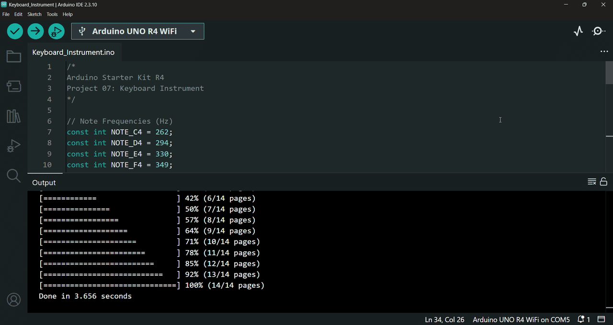

# 🎹 Keyboard Instrument

In this project, I built an Arduino musical keyboard using *resistors*, *pushbuttons* and a *piezo capsule*.

This project is based on Project 07 from the Arduino Starter Kit R4.

---

## 🔎 Circuit Demo

  

  <a href="https://github.com/Royaltyclaws22/Arduino-Starter-Kit-R4-Learning-Journey/releases/download/v0.7/keyboard_instrument_circuit.mp4">
    ▶ Watch Full Video (with sound)
  </a>

---

## 🎯 Objective

The purpose of this project is to understand how a *resistor* ladder works and learn how to use arrays in Arduino programming.

---

## 🔋 Components

List of hardware components used:
- Arduino UNO R4 WiFi Board
- USB-C Cable
- Breadboard
- 1 x 220 Ω Resistor
- 2 x 10 kΩ Resistors
- 1 x 1 MΩ Resistor
- 4 x Pushbuttons (Switches)
- 1 x Piezo Capsule
- Solid Core Jumber Wires
- Stranded Jumper Wires

---

## 🛠️ Circuit Implementation

This project demonstrates a keyboard instrument using an *Arduino UNO R4 WiFi Board* to play different audio frequencies using four *Pushbuttons* configured in a *Resistor* ladder voltage divider circuit and a *Piezo Element* as the speaker.

### 🔌 Power Source
* **5V** on Arduino $\rightarrow$ Positive ($+$) power rail of the *breadboard* (Red wire)
* **GND** on Arduino $\rightarrow$ Negative ($-$) ground rail of the *breadboard* (Black wire)

### 🎹 Input Section: Resistor Ladder & Pushbuttons
A set of four *pushbuttons* connected in a *resistor* ladder arrangement feeds different voltage levels into a single analog input pin.

* **Common Junction & Pull-Down Connection:**
  * One side of all four *switches* is connected together to a single common junction line on the *breadboard*.
  * This common junction is connected directly to Arduino analog input pin `A0`.
  * The common junction is also connected to the common ground ($-$) rail through a *10kΩ resistor* (pull-down *resistor*) to complete the voltage divider setup.
* **Switch Power Connections:**
  * **Switch 1:** Connected directly to the positive ($+$) 5V power rail.
  * **Switch 2:** Connected to the positive ($+$) 5V power rail through a *220Ω resistor*.
  * **Switch 3:** Connected to the positive ($+$) 5V power rail through a *10kΩ resistor*.
  * **Switch 4:** Connected to the positive ($+$) 5V power rail through a *1MΩ resistor*.

### 🔊 Output Section: Piezo Element
A *piezo element* acts as the primary audio output component to output specific musical tones based on which *button* is pressed.

* **Ground Connection:** One leg of the *piezo* connects directly to the common ground ($-$) rail.
* **Signal Line (Digital Pin):** The other leg of the *piezo* connects directly to Arduino digital pin `8`.

### ⚠️ Safety Tip
To ensure hardware safety, the *Arduino board* is strictly kept disconnected from any power source (via the *USB-C cable*) throughout the circuit assembly process. The board is only connected to the computer via the *USB-C cable* once all physical connections and circuit designs are fully completed and verified.

---

## 📤 Setup & Upload

1. Connect your *Arduino Board* to your computer using the *USB-C Cable*.
2. Open the `.ino` file in the Arduino IDE.
3. Select the correct `Board` and `Port` from the `Tools` menu.
4. Click `Upload` to compile and upload the sketch to the board.
5. Once the upload is complete, click the `Serial Monitor` icon and the program will start running automatically.

---

## ⚙️ How it Works

The circuit operates as an interactive electronic keyboard instrument that uses a *resistor* ladder to convert four *pushbutton switches* into distinct analog voltage levels. The Arduino measures these values and translates them into corresponding musical pitch frequencies played through a *piezo element*:

* **System Initialization & Debugging (Setup Phase):**
  * Upon starting, the program initializes serial communication at `9600` baud rate.
  * This allows real-time monitoring of analog input values via the *Serial Monitor* to help verify *button* readings and calibrate threshold ranges.

* **Analog Input Sensing (Inputs):**
  * The *pushbuttons* and *resistors* connected to pin `A0` form a multi-stage voltage divider (*resistor* ladder).
  * Pressing a *button* completes a specific circuit path with a unique resistance, sending a distinct analog voltage to pin `A0` (read as a raw 10-bit integer value between `0` and `1023`).

* **Decision Logic & Frequency Mapping (Program Logic):**
  * In every iteration of the main loop, the voltage is sampled from the *resistor* ladder.
  * The program evaluates the sampled voltage reading, and depending on which predefined numerical range it falls into, selects the corresponding musical pitch:
    * **Range 1021–1023:** Plays **C4** (`262 Hz`)
    * **Range 990–1022:** Plays **D4** (`294 Hz`)
    * **Range 495–515:** Plays **E4** (`330 Hz`)
    * **Range 1–8 or 13–25:** Plays **F4** (`349 Hz`)
  * If no *button* is pressed (or if the reading falls outside these target ranges), the program mutes the audio output.

* **Audio Output Generation (Output):**
  * When a valid *button* press is detected, the program outputs a square-wave signal of the designated frequency on digital pin `8`.
  * This signal drives the *piezo element*, vibrating its internal diaphragm to produce audible musical tones.

* **Interactive User Behavior:**
  * **Single Note Playback:** Pressing any single *pushbutton* triggers one of four distinct musical notes (C4, D4, E4, or F4) through the *piezo capsule*.
  * **Multi-Button Experimentation:** Pressing multiple *buttons* simultaneously creates new resistance combinations, producing new raw analog values on pin `A0`. By reading these new values via the *Serial Monitor*, the code can be expanded to trigger even more musical frequencies.
  * **Calibration & Range Tuning:** If *button* presses cause sound stuttering or fail to trigger tones due to *resistor* tolerances, inspecting the exact readings on the *Serial Monitor* and slightly widening or shifting the ranges in the `if...else` conditional statements can help.
 
---

## 💻 Code

The program is organized into two main functions:

- `setup()` – Initializes serial communication with the *Serial Monitor* for debugging.
- `loop()` – Continuously reads the analog value from the *resistor* ladder, displays the measured value in the *Serial Monitor*, identifies which *pushbutton* is pressed based on predefined analog ranges, and plays the corresponding musical note through the *piezo element*. If no valid *button* is detected, the sound is stopped.

### Key Functions Used

- `Serial.begin()` – Initializes serial communication with the *Serial Monitor* at `9600` communication speed (baud rate).
- `analogRead()` – Reads the analog value produced by the *resistor* ladder connected to the *pushbuttons*.
- `Serial.println()` – Displays the measured analog value in the *Serial Monitor* for debugging and calibration.
- `tone()` – Generates a square wave at the specified frequency to play a musical note through the *piezo capsule*.
- `noTone()` – Stops generating the sound when no valid *button* is detected.

---

## 🎓 What I Learned

Through building this project, I gained hands-on experience with analog inputs, resistor ladders, arrays, and sound generation using Arduino:

* **Resistor Ladders**
  * Learned that a *resistor* ladder is an arrangement of *resistors* and *pushbuttons* connected to a single analog input.
  * Understood that *resistor* ladders provide an efficient way to read multiple digital inputs while using only one analog pin.

* **Calibration & Range Tuning**
  * Learned that the analog values produced by a *resistor* ladder can vary due to *resistor* tolerances.
  * Practiced using the *Serial Monitor* to inspect the ADC readings and fine-tune the value ranges in the `if...else` statements, improving *button* detection reliability and preventing false detections, sound stuttering or missed *button* presses.

* **Arrays**
  * Learned how to use arrays to group related data, such as note frequencies, into a single data structure.
  * Understood how arrays make code cleaner, more organized, and easier to maintain.

* **Sound Generation**
  * Practiced generating musical notes with a *piezo element* using the `tone()` and `noTone()` functions.
  * Learned how different frequencies correspond to different musical notes.

---

## 🚀 Future Improvements

Possible extensions for this project include:

- Adding more *pushbuttons* and notes to expand the keyboard's range.
- Adding a potentiometer to control the volume or other sound parameters.
- Adding an LCD/OLED display to show the currently selected note and provide visual feedback.
