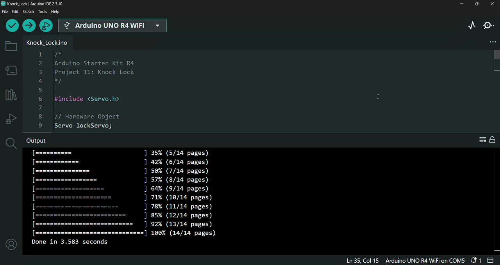

# 🔒 Knock Lock

In this project, I built an Arduino Knock Lock that uses a *piezo capsule* to detect valid knocks and a *servo motor* to simulate a simple locking mechanism.

This project is based on Project 11

---

## 🔎 Circuit Demo

---

## 🎯 Objective

The purpose of this project is to understand how a *piezo element* can also be used as an input and to practice writing my own functions.

---

## 🔋 Components

List of hardware components used:
- Arduino UNO R4 WiFi Board
- USB-C Cable
- Breadboard
- 3 x 220 Ω Resistors
- 1 x 10 kΩ Resistor
- 1 x 1 MΩ Resistor
- 1 x 100 µF Capacitor
- 1 x Red LED
- 1 x Green LED
- 1 x Yellow LED
- 1 x Pushbutton (Switch)
- 1 x Piezo Capsule
- 1 x Small Servo Motor
- 1 x Motor Arm
- Solid Core Jumber Wires
- Stranded Jumper Wires

---

## 🛠️ Circuit Implementation

This project implements a knock-detecting lock mechanism using an *Arduino UNO R4 WiFi Board*. It utilizes a *Piezo Element* as an analog vibration/knock sensor, a *Pushbutton* for manual locking, three status *LEDs* *(Red, Green, Yellow)* to indicate the system state, and a *Servo Motor* to actuate the lock mechanism.

### 🔌 Power Source
* **5V** on Arduino $\rightarrow$ Positive ($+$) power rail of the *breadboard* (Red wire)
* **GND** on Arduino $\rightarrow$ Negative ($-$) ground rail of the *breadboard* (Black wire)
* Jumper wires connect the power and ground rails between both sides of the *breadboard* to provide common power throughout the circuit.

### 🔘 Input Section: Pushbutton & Piezo Sensor
* **Pushbutton (Lock Trigger):**
  * One terminal connects directly to the positive ($+$) 5V power rail.
  * The opposite terminal connects to Arduino digital pin `2`.
  * The signal terminal is also connected to the common ground ($-$) rail through a *10kΩ pull-down resistor*.
* **Piezo Element (Vibration / Knock Detector):**
  * One leg connects directly to the positive ($+$) 5V power rail.
  * The other leg connects to Arduino analog input pin `A0`.
  * A *1MΩ resistor* is connected across the signal terminal and common ground ($-$) rail in parallel to establish the baseline voltage and define knock sensitivity.

### 🚦 Output Section: Status LEDs & Servo Motor
* **Status LEDs:**
  * **Cathodes (Short legs):** All connected directly to the common ground ($-$) rail.
  * **Anodes (Long legs):** Connected through *220Ω current-limiting resistors* to their respective Arduino digital pins:
    * **Yellow LED:** Arduino digital pin `3`
    * **Green LED:** Arduino digital pin `4`
    * **Red LED:** Arduino digital pin `5`
* **Servo Motor (Lock Actuator):**
  * **Power (Red wire):** Connects to the positive ($+$) 5V power rail.
  * **Ground (Black wire):** Connects to the common ground ($-$) rail.
  * **Control Signal (White wire):** Connects to Arduino digital (PWM) pin `9` .
  * **Decoupling Capacitor:** A *100µF capacitor* is placed across the power ($+$) and ground ($-$) rails near the *servo motor* connections (observing proper polarity) to smooth out voltage dips caused by *motor* movement.

### ⚠️ Safety Tip
To ensure hardware safety, the *Arduino board* is strictly kept disconnected from any power source (via the *USB-C cable*) throughout the circuit assembly process. The board is only connected to the computer via the *USB-C cable* once all physical connections and circuit designs are fully completed and verified.

---

## 📤 Setup & Upload

1. Connect your *Arduino Board* to your computer using the *USB-C Cable*.
2. Open the `.ino` file in the Arduino IDE.
3. Select the correct `Board` and `Port` from the `Tools` menu.
4. Click `Upload` to compile and upload the sketch to the board.
5. Once the upload is complete, click the `Serial Monitor` icon and the program will start running automatically.

---

## ⚙️ How it Works

The circuit operates as an interactive knock-sensitive locking mechanism. It monitors manual *pushbutton* inputs and mechanical vibrations through a *piezo element*, using that feedback to toggle between locked and unlocked states via status *LEDs* and a *servo motor*:

* **System Initialization (Setup Phase):**
  * Upon powering on, the *servo motor* rotates to `0°` (the unlocked position), the *green LED* turns `ON`, and the *red/yellow LEDs* remain `OFF`.
  * The Serial Monitor initializes at `9600 baud` and outputs `"The box is unlocked!"`, indicating that the system is disengaged and ready for user interaction.

* **Sensor & Button Reading (Inputs):**
  * **Pushbutton:** Reads a digital signal on pin `2` to detect a manual locking command (`HIGH` state).
  * **Piezo Element:** Acts as an analog vibration sensor connected to pin `A0`, reading analog intensity values generated by physical knocks or taps.

* **Decision Making & State Logic (Program Logic):**
  * **Locking Trigger:** When the system is unlocked and the *pushbutton* is pressed, the system transitions to the locked state. The *green LED* turns `OFF`, the *red LED* turns `ON`, and the *servo* rotates `90°` to engage the lock.
  * **Knock Validation:** While locked, the program listens to analog readings from the *piezo*:
    * Readings between `QUIET_KNOCK_THRESHOLD` (`10`) and `LOUD_KNOCK_THRESHOLD` (`100`) are evaluated as valid knocks.
    * Each valid knock briefly flashes the *yellow LED* for `50ms`.
    * Knock values outside this range are ignored, rejecting ambient noise or excessive force.
  * **Unlocking Trigger:** Once `3 valid knocks` are registered, the system unlocks: the *servo* rotates back to `0°`, the *red LED* turns `OFF` and the *green LED* turns `ON`.

* **Feedback & Actuation (Outputs):**
  * **Servo Motor (Pin 9):** Physically moves between `0°` (unlocked) and `90°` (locked) to mechanically secure or release a latch.
  * **Status LEDs (Pins 3, 4, 5):**
    * **Green LED (Pin 4):** Indicates the unlocked state.
    * **Red LED (Pin 5):** Indicates the locked state.
    * **Yellow LED (Pin 3):** Blinks to provide immediate visual feedback for each registered valid knock.
  * **Serial Monitor Feedback:** Transmits real-time status messages, detected knock values, and the remaining knock countdown.

* **Interactive User Behavior:**
  * **Locking the Box:** Press the *pushbutton* once to lock the mechanism; you will see the *red LED* illuminate and the *servo* rotate `90°` into the locking position.
  * **Unlocking Sequence:** Tap or knock gently on or near the *piezo element*. Watch the *yellow LED* flash and monitor the Serial Monitor to see your knock intensity and remaining count. If needed, you can adjust the values of `QUIET_KNOCK_THRESHOLD` and `LOUD_KNOCK_THRESHOLD`. Deliver `3 valid knocks` to disengage the lock and illuminate the *green LED*.
  * **Physical Installation:** You can rearrange the *breadboard* and components to fit compactly inside a custom enclosure or wooden box. Cut a suitable slot or notch in the box lid/casing so the horn of the *servo motor* acts as a physical bolt, mechanically preventing or allowing the lid to open based on its angle.

---

## 💻 Code

The program is organized into three main functions:

- `setup()` – Initializes the *servo motor*, configures the *LED* and *pushbutton* pins, starts serial communication, and sets the lock to its initial unlocked state.
- `loop()` – Continuously checks whether the lock *button* has been pressed, listens for valid knocks while the system is locked, and unlocks the system after `3 valid knocks`.
- `checkForKnock()` – Validates whether the detected knock falls within the accepted strength range, briefly flashes the *yellow LED*, and reports the result through the Serial Monitor.

### Key Functions Used

- `Servo.attach()` – Connects the *servo motor* to its control pin.
- `pinMode()` – Configures the *LED* and *pushbutton* pins.
- `Serial.begin()` – Initializes serial communication with the Serial Monitor at `9600` communication speed (baud rate).
- `digitalRead()` – Reads the state of the *pushbutton*.
- `digitalWrite()` – Controls the *LEDs* to indicate whether the system is locked or unlocked and flashes the *yellow LED* when a valid knock is detected.
- `Servo.write()` – Rotates the *servo motor* to the locked and unlocked positions.
- `Serial.print()` / `Serial.println()` – Displays the lock status, knock validation results, and remaining number of knocks in the Serial Monitor.
- `delay()` – Adds short pauses for the lock sequence and *LED* indication.
- `analogRead()` – Reads the vibration level from the *piezo element*.

---

## 🎓 What I Learned

Through building this project, I gained hands-on experience with *piezo sensors*, *servo motor* control, and writing more structured Arduino programs:

* **Using a Piezo Element as an Input Sensor**
  * Learned that a *piezo element* can also be used as an input device when connected as a voltage divider with a high-value resistor.
  * Understood that the *piezo element* can detect vibrations and generate voltage changes that can be read by the Arduino's analog inputs.
  * Learned how pressing the *piezo element* against a solid vibrating surface, such as a wooden tabletop, allows the Arduino to measure the intensity of a knock.

* **Controlling a Servo Motor**
  * Practiced using the `Servo.h` library by creating a `Servo` object and controlling its movement.
  * Gained more experience using functions such as `Servo.attach()` to connect the *servo motor* to a specific pin and `Servo.write()` to move it to a desired position.
  * Understood how a *servo motor* can be used to simulate a simple locking mechanism.

* **Writing More Complex Arduino Programs**
  * Gained experience developing a more complex program that combines multiple inputs and outputs, including a *piezo sensor*, *pushbutton*, *LEDs*, and a *servo motor*.
  * Understood the importance of creating custom functions to perform specific tasks, allowing code to be reused and making the program cleaner, more organized, and easier to maintain.

---

## 🚀 Future Improvements

Possible extensions for this project include:

- Adding a more advanced knock detection algorithm that can recognize specific knock patterns instead of only counting `3 valid knocks`.
- Adding an LCD display or additional *LEDs* to provide clearer feedback about the lock status and the number of remaining knocks.
- Improving the security of the system by replacing the *pushbutton* activation with a password input, RFID reader, or another authentication method.
