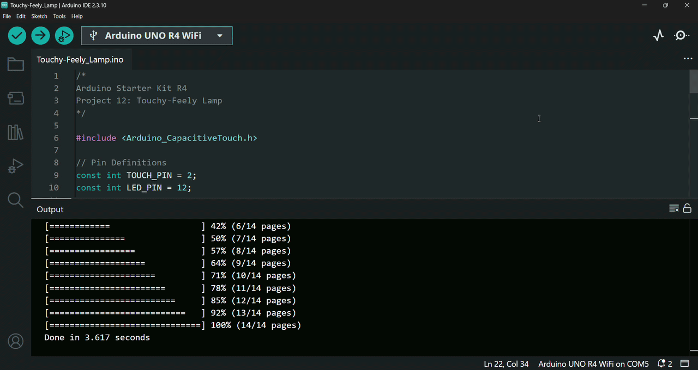

# 💡 Touchy-Feely Lamp

In this project, I built an Arduino lamp that demonstrates capacitive touch sensing by turning on an *LED* when a piece of conductive material is touched using the `Arduino_CapacitiveTouch` library.

This project is based on Project 12 from the Arduino Starter Kit R4.

---

## 🔎 Circuit Demo

---

## 🎯 Objective

The purpose of this project is to learn how to install specialized libraries in the Arduino IDE and understand the principles behind capacitive touch sensing.

---

## 🔋 Components

List of hardware components used:
- Arduino UNO R4 WiFi Board
- USB-C Cable
- Breadboard
- 1 x 220 Ω Resistor
- 1 x Red LED
- Metal Foil
- Solid Core Jumber Wires
- Stranded Jumper Wires

---

## 🛠️ Circuit Implementation

This project demonstrates a capacitive touch-controlled lamp using an *Arduino UNO R4 WiFi Board*. It leverages the *UNO R4's* built-in capacitive touch sensing capabilities to detect touch via a *conductive foil* sensor and toggle/control an *LED* indicator.

### 🔌 Ground Connection
* **GND** on Arduino $\rightarrow$ Negative ($-$) ground rail of the *breadboard* (Black wire)
* **Note:** No external 5V power supply rail is required for this build, as the capacitive touch sensing is handled natively via the *microcontroller's* internal hardware.

### 👆 Input Section: Capacitive Touch Sensor
A standalone wire with *metal/aluminum foil* acts as the touch-sensitive input surface.

* **Touch Pin Connection:** A long jumper wire (approx. `8–10 cm`) connects directly from Arduino digital pin `2` out to an external piece of *metal foil*.

### 💡 Output Section: LED
A standard *red LED* serves as the lamp output indicator.

* **Signal Line (Digital Pin):** The long leg (anode) of the *LED* connects directly to Arduino digital pin `12`.
* **Current-Limiting Resistor & Ground:** The short leg (cathode) of the *LED* connects to the common ground ($-$) rail through a *220Ω resistor* to prevent excessive current draw.

### ⚠️ Safety Tip
To ensure hardware safety, the *Arduino board* is strictly kept disconnected from any power source (via the *USB-C cable*) throughout the circuit assembly process. The board is only connected to the computer via the *USB-C cable* once all physical connections and circuit designs are fully completed and verified.

---

## 📤 Setup & Upload

1. Connect your *Arduino Board* to your computer using the *USB-C Cable*.
2. Open the `.ino` file in the Arduino IDE.
3. Select the correct `Board` and `Port` from the `Tools` menu.
4. Click `Upload` to compile and upload the sketch to the board.
5. Once the upload is complete, click the `Serial Monitor` icon and the program will start running automatically.

---

## ⚙️ How it Works

The circuit operates as an interactive capacitive touch lamp that continuously reads capacitance values from a conductive sensor connected to digital pin `2` and turns an *LED* indicator on whenever the touch reading surpasses a defined threshold:

* **Capacitive Touch Initialization (Setup Phase):**
  * The serial interface is initialized at `9600 baud` for real-time monitoring and debugging.
  * Digital pin `12` is configured as an `OUTPUT` to drive the *LED*.
  * The `Arduino_CapacitiveTouch` library initializes the touch peripheral on pin `2` and sets the baseline threshold `TOUCH_THRESHOLD` at `4000`.
  * The configured threshold value is printed to the Serial Monitor at startup.

* **Capacitive Input Sensing (Inputs):**
  * The *conductive wire/foil* attached to pin `2` acts as a capacitive touch sensor.
  * In each loop cycle, the program samples the pin's capacitance, outputting the live numeric reading to the Serial Monitor.

* **Threshold Evaluation & State Logic (Program Logic):**
  * The code evaluates the current sensor state.
  * If touching the *wire/foil* causes the measured capacitive value to exceed the configured `TOUCH_THRESHOLD`, the condition evaluates to `true`, signaling a touch event.
  * When no touch is detected (or the reading remains below the threshold), the condition evaluates to `false`.

* **Visual Output Control (Output):**
  * When a touch event is registered, the message `"Touched!"` is sent over the Serial Monitor and digital pin `12` is driven `HIGH`, illuminating the *red LED*.
  * As soon as touch is removed, digital pin `12` is driven `LOW`, turning the *LED* `OFF`.
  * A small delay of `10ms` executes at the end of each cycle to provide stable and debounced sensor readings.

* **Interactive User Behavior:**
  * **Reading Sensor Values:** Open the Serial Monitor after uploading the code to observe the resting baseline numbers displayed when the wire is untouched. Next, gently press the bare *wire/foil* sensor with your fingers—the reading should immediately increase. Experiment by pressing more firmly to observe how physical contact surface alters the numeric value.
  * **Tuning Baseline Threshold:** If the *LED* does not respond reliably, you can adjust the `TOUCH_THRESHOLD` constant directly in the sketch. Pick a value situated comfortably between your resting (untouched) reading and your active (touched) reading.
 
---

## 💻 Code

The program is organized into two main functions:

- `setup()` – Initializes the Serial Monitor, configures the *LED* pin as an output, initializes the capacitive touch sensor, sets the touch detection threshold, and displays the configured threshold value.
- `loop()` – Continuously reads the raw capacitive touch value, prints the sensor reading to the Serial Monitor, detects whether the sensor is being touched, and turns the *LED* `ON` or `OFF` accordingly.

### Key Functions Used

- `Serial.begin()` – Initializes serial communication with the Serial Monitor at `9600` communication speed (baud rate).
- `pinMode()` – Configures the *LED* pin as an output.
- `touchSensor.begin()` – Initializes the capacitive touch sensor.
- `touchSensor.setThreshold()` – Sets the minimum sensor value required to detect a touch.
- `touchSensor.getThreshold()` – Returns the currently configured touch detection threshold.
- `Serial.print()` / `Serial.println()` – Displays the touch threshold, raw sensor readings, and touch detection messages in the *Serial Monitor*.
- `touchSensor.read()` – Reads the raw capacitive touch value.
- `touchSensor.isTouched()` – Checks whether the measured value exceeds the configured touch threshold.
- `digitalWrite()` – Turns the *LED* `ON` or `OFF` based on the touch detection result.
- `delay()` – Adds a short pause between sensor readings to improve measurement stability.

---

## 🎓 What I Learned

Through building this project, I gained hands-on experience and practical knowledge about capacitive touch sensing, Arduino libraries, and how changes in capacitance can be used to detect human touch:

* **Capacitance and Capacitive Touch Sensing**
  * Learned that capacitance is a measure of how much electrical charge a material or object can store.
  * Understood how the *Arduino UNO* features dedicated hardware called the CTSU (Capacitive Touch Sensing Unit), which can directly measure tiny changes in capacitance on specific pins without requiring external resistors or multiple pin connections.
  * Learned that when a conductive material connected to a sensor pin is touched, the human body slightly changes the capacitance of the pin. The hardware detects this change, allowing the Arduino to accurately and reliably sense touch events.

* **Using the `Arduino_CapacitiveTouch` Library**
  * Learned how to install and use specialized libraries in the Arduino IDE, such as the `Arduino_CapacitiveTouch` library.
  * Practiced converting regular Arduino pins into touch sensors by connecting them to a conductive surface, such as *aluminum foil*.
  * Used the library functions `touchSensor.begin()`, `touchSensor.setThreshold()`, `touchSensor.getThreshold()`, `touchSensor.read()`, and `touchSensor.isTouched()` to initialize the sensor, configure the detection threshold, read capacitance values, and detect touch events.
  * Applied capacitive touch sensing to control an *LED*, turning it on whenever a touch event was detected.

* **Sensor Design and Sensitivity**
  * Understood that capacitive touch sensors can detect changes in capacitance even through non-conductive materials, such as wood and plastic, because the dielectric properties of these materials affect capacitance. Materials with higher relative permittivity (εᵣ) produce larger capacitance changes:
$$
C \propto \varepsilon_r
$$
  * Learned that increasing the surface area of the conductive sensor increases its sensitivity, since the capacitance of a sensor electrode is generally proportional to its surface area:
$$
C \propto A
$$
    where increasing the electrode area (A) results in a larger change in capacitance and improves touch detection sensitivity.
  * Learned why larger conductive surfaces, such as *aluminum foil* or copper mesh, are recommended when creating custom touch sensors.
  * Understood how a larger conductive surface can be used to create a practical lamp base by attaching *foil* to the sensor wire and placing it inside a base made of cardboard, thin wood, or cloth. The entire base can then function as a touch sensor.

---

## 🚀 Future Improvements

Possible extensions for this project include:

- Adding an adjustable touch sensitivity system using a potentiometer or automatic calibration to adapt the sensor threshold to different environments and materials.
- Adding multiple capacitive touch areas to control different *LEDs*, brightness levels, or lighting patterns depending on where the user touches the lamp.
- Adding wireless connectivity using an ESP32 module to enable smartphone control, remote monitoring, programmable lighting modes, and smart home integration.
